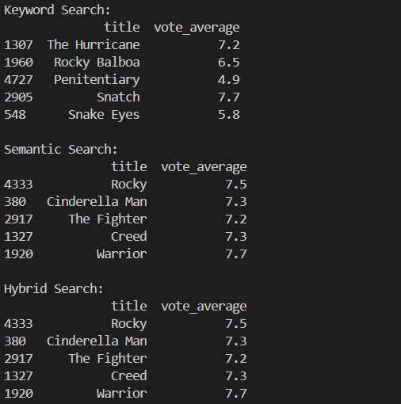

# Semantic Search Engine for Movies

## 📌 Project Overview

This project implements a **Semantic Search Engine** for movies using Natural Language Processing (NLP) techniques. The system allows users to search for movies based on meaning rather than exact keyword matching.

The project compares three retrieval approaches:

1. **TF-IDF Keyword Search (Lexical Retrieval)**
2. **Semantic Search using Sentence Embeddings**
3. **Hybrid Search (Semantic + Genre Filtering)**

The goal is to demonstrate the difference between traditional lexical search and modern embedding-based semantic retrieval.

---

## 🎯 Problem Statement

Traditional search systems rely on exact keyword matching. This often fails when users express intent using synonyms or emotional descriptions.

Example:

* Query: "loneliness in space"
* TF-IDF may only match the word "space"
* Semantic search understands concepts like isolation, survival, emotional distress

This project explores how embedding-based models improve retrieval quality and how hybrid filtering stabilizes domain-specific results.

---

## 📂 Dataset

Dataset Used: **TMDB 5000 Movies Dataset**

Key fields used:

* `title`
* `overview`
* `tagline`
* `genres`
* `keywords`
* `vote_average`

### Data Processing Steps

1. Removed rows with missing `overview`
2. Filled missing `tagline` values
3. Parsed JSON-like `genres` and `keywords`
4. Created unified `semantic_text` column
5. Saved cleaned dataset for downstream use

## Data Flow Architecture

```
Raw Dataset (TMDB)
        |
        v
Data Cleaning & Feature Engineering
        |
        v
semantic_text Creation
        |
        v
Embedding Generation (384-d vectors)
        |
        v
Saved Embeddings (.npy file)
        |
        v
Search Modules (Keyword / Semantic / Hybrid)
```


---

## 🏗 System Architecture

The system is divided into modular components:

* Data Cleaning Pipeline
* Keyword Search Module (TF-IDF)
* Semantic Search Module (Sentence Embeddings)
* Hybrid Search Module (Semantic + Genre Filter)

## High-Level System Architecture
```
                +----------------------+
                |      User Query      |
                +----------+-----------+
                           |
                           v
                +----------------------+
                |   Query Processing   |
                |  (Optional Genre     |
                |    Detection)        |
                +----------+-----------+
                           |
        ---------------------------------------------
        |                     |                     |
        v                     v                     v
+----------------+   +----------------+   +----------------+
|  TF-IDF Model  |   | Embedding Model|   | Hybrid Logic   |
| (Sparse Vectors)|  | (Dense Vectors)|   | (Filter +      |
|  Cosine Sim.)  |   | Cosine Sim.)   |   |  Semantic)     |
+--------+-------+   +--------+-------+   +--------+-------+
         |                    |                    |
         v                    v                    v
   Ranked Results       Ranked Results       Filtered + Ranked
         |                    |                    |
         -------------------------------------------
                           |
                           v
                +----------------------+
                |     Final Output     |
                |  (Top-N Movies)      |
                +----------------------+
```


Each search strategy is implemented as a separate class inside the `src/` directory.

---

## 🔍 Search Approaches

### 1️⃣ TF-IDF Keyword Search

* Converts text into sparse vectors
* Uses cosine similarity
* Performs literal word matching
* Struggles with synonyms and emotional context

### 2️⃣ Semantic Search

* Uses `all-MiniLM-L6-v2` sentence transformer
* Generates 384-dimensional dense embeddings
* Captures contextual and emotional similarity
* May ignore strict genre constraints

### 3️⃣ Hybrid Search

* Detects genre keywords from user query
* Filters dataset by detected genres
* Applies semantic similarity within filtered set
* Produces most stable results for multi-intent queries

---

## 📊 Comparative Evaluation

The system was evaluated on diverse queries:

Examples:

* "loneliness in space"
* "italian mafia family business"
* "emotional father daughter relationship"
* "highly motivating boxing story"

### Observations:

* TF-IDF performs well for exact keyword queries
* Semantic search captures thematic and emotional meaning
* Hybrid search provides best balance between relevance and domain specificity

Conclusion:
Hybrid search offers the most stable and contextually appropriate results.

---

## 🧠 Technical Stack

* Python
* Pandas
* Scikit-learn
* Sentence-Transformers
* NumPy

---

## 📁 Project Structure

```
semantic-search-engine/
│
├── notebooks/
│   ├── 01_data_exploration.ipynb
│   ├── 02_data_cleaning_and_feature_engineering.ipynb
│   ├── 03_keyword_search.ipynb
│   └── 04_semantic_search.ipynb
│
├── src/
│   ├── keyword_search.py
│   ├── semantic_search.py
│   └── hybrid_search.py
│
├── data/
│   ├── raw/
│   └── processed/
│
├── test_search.py
├── requirements.txt
└── README.md
```

---

## 🚀 How to Run

1. Install dependencies:

```
pip install -r requirements.txt
```

2. Run the test script:

```
python test_search.py
```

3. Enter queries inside the script or modify `test_search.py`.

---

## Example Output

query: highly motivating boxing story

Below is a sample output of the system when running a query using the Hybrid Search module:



## 🔮 Future Improvements

* Add Streamlit-based UI
* Implement FAISS for faster vector search
* Add ranking re-weighting using vote_average
* Deploy as REST API using FastAPI

---

## 🎓 Learning Outcomes

This project demonstrates:

* Vector Space Models
* Cosine Similarity
* Sparse vs Dense Representations
* Sentence Embeddings
* Hybrid Retrieval Systems
* Modular ML System Design

---

